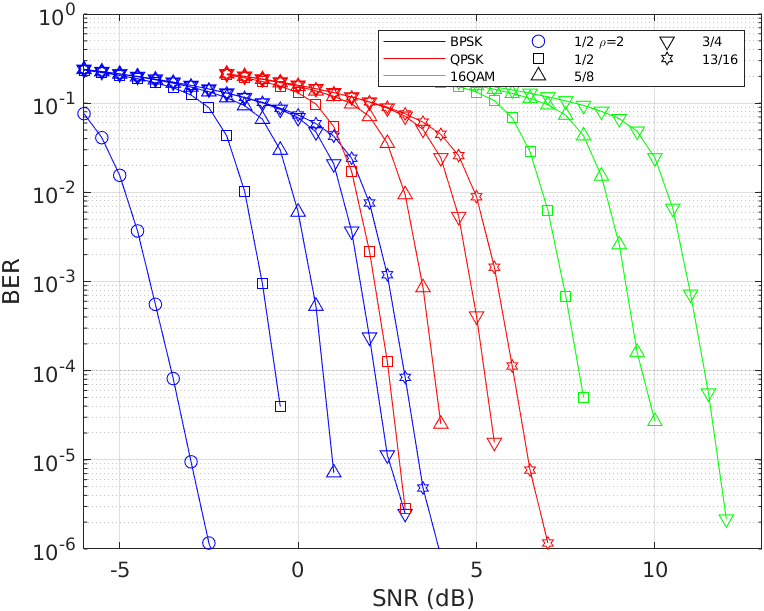

# LIQUID EDGE IEEE 802.11ad PHY Simulator


> These programs are a part of the system used for the LIQUID EDGE PRIN 2017 project demonstrator.

This repository contains the code of an IEEE 802.11ad physical (PHY) layer simulator written in MATLAB: it is used in the WP6 demonstrator workpackage of the LIQUID EDGE research project.
The standard receiver is improved, at the PHY layer, with some additional features, with the purpose to increase the SNR performance over multipath channels.

Full details of the new techniques are given in the paper below, which you are kindly asked to cite in case some code from this repository is used:

> G. Baruffa, L. Rugini, "Improved Channel Estimation and Equalization for Single-Carrier IEEE 802.11ad Receivers," submitted to _Radioengineering_, 2023.

## Features

The simulator implements portions of the PHY described in the standard [1]. It may also use measured channel data described in [2,3].
It currently supports modulation and coding schemes (MCS) from 1 through 12. i.e., all single-carrier (SC) modes, no OFDM, all code rates, BPSK-QPSK-16QAM mappings.

## Requirements

The following versions of MATLAB and ToolBoxes are required:

* MATLAB 9.14 (R2023a)
* Signal Processing Toolbox 9.2 (R2023a)
* Communications Toolbox 8.0 (R2023a)

## Structure of the simulator

The transmitter and receiver code is found in a single file, _ieee80211ad.m_ (in the _src_ folder), which is a MATLAB class.

For simple simulations you should use the file _main.m_ (in the _src_ folder), where you can modify the simulation parameters (at the beginning of the file) according to your requirements. For instance, this is the content of the interesting section of that file:

```matlab
...
% standard variable parameters
MCS = 1; % SC MCS index (1-5=BPSK, 6-9=QPSK, 10-12=16QAM)
L_PS = 1500; % N_PSDU, Length of data octets (1–262143)

% simulation variable parameters
ftypetx = 'RRC'; % TX filtering type: RRC or GAU
ftyperx = 'RRC'; % RX filtering type: RRC or GAU
M_o = 1; % channel oversampling factor (i.e., "analog" signal rate)
numpacks = 100; % number of packets in each cycle
h_ch = variablechannel(RandStream('mt19937ar', 'Seed', 823), M_o); chname = 'rand823'; % communication channel taps
SNRdBlist = -6:1:8; % average SNR for MCS1-5 - coarse
usepreamble = false; % generate (and transmit) the preamble part
useheader = false; % generate (and transmit) the header part
usedata = true; % generate (and transmit) the data part
chestimate = 1; % estimate the channel:
                % 1 = perfect channel, 4 = LXC, 5 = PI,
                % 6 = SXC, 7 = SMS
equalize = 2; % equalize the signal:
              % 0 = recovers delay/amplitude/phase of the largest tap,
              % 1 = ZFEQ, 2 = MMSEQ
ibicancel = 0; % IBI cancellation (0 = disabled, 1 = active)
chshorten = 0; % channel shortening (0 = disabled, 1 = active)
chshalpha = 0; % unused parameter
llrmethod = 0; % LLR update method: 0 = conventional, 1 =  proposed
savepath = 'results/'; % path where figs and pdfs are saved
...
```

For additional channel models, refer to the instructions in the [README](data/README.md) of the _data_ folder for the installation. Then, you can use the channel model by uncommenting the corresponding line in the _main.m_ script. Running this script results in the following figure, which shows the simulation over a non-AWGN channel. The curves describe the BER of the coded and uncoded bits, when possible compared to theoretical expressions, as well as the simulated and expected frame error rate.


If you need to do more complex simulations, like for example those described in the paper [4], you should use one of the files in the _batch_ folder, which run _main.m_ multiple times, each time changing the parameters, according to the chosen scheme. Please open one of the files in the _batch_ folder to understand their operation: essentially, parameters are set, stored in a .MAT file, and then loaded inside of _main.m_.

During and at the end of the simulations, figures are shown and intermediate results are saved in .MAT, .FIG, .PDF, and .PNG files, located in the _results_ folder.

For instance, the following figure is generated after running *batch/batch_perfect_awgn.m*: this is the BER performance on AWGN channels for all modes MCS1 through MCS12.



The following figure, instead, results from running *batch/batch_SMS_LLR.m*. This represents the BER performance of SMS estimation on an IBI-generating channel, with and without the proposed LLR update [4].


Finally, this figure comes out of *batch/SMS_IBIC.m*. It shows the BER advantage of using IBI cancellation on long CIR channels.


## Performance of channel estimators

The NMSE performance of the tested channel estimators can be assessed using the file *chest_methods.m* in the folder _src/test_. The resulting figure is reported below.


## References

1. "IEEE Standard for Information technology--Telecommunications and information exchange between systems--Local and metropolitan area networks--Specific requirements-Part 11: Wireless LAN Medium Access Control (MAC) and Physical Layer (PHY) Specifications Amendment 3: Enhancements for Very High Throughput in the 60 GHz Band," in _IEEE Std 802.11ad-2012 (Amendment to IEEE Std 802.11-2012, as amended by IEEE Std 802.11ae-2012 and IEEE Std 802.11aa-2012)_, pp.1-628, 28 Dec. 2012, doi: 10.1109/IEEESTD.2012.6392842
2. P. Liu, J. Blumenstein, N. S. Perović, M. Di Renzo and A. Springer, "Performance of Generalized Spatial Modulation MIMO Over Measured 60GHz Indoor Channels," in _IEEE Transactions on Communications_, vol. 66, no. 1, pp. 133-148, Jan. 2018. doi: 10.1109/TCOMM.2017.2754280 URL: http://ieeexplore.ieee.org/stamp/stamp.jsp?tp=&arnumber=8046024&isnumber=8258580
3. J. Blumenstein, J. Milos, L. Polak and C. Mecklenbräuker, "IEEE 802.11ad SC-PHY Layer Simulator: Performance in Real-world 60 GHz Indoor Channels," _2019 IEEE Nordic Circuits and Systems Conference (NORCAS): NORCHIP and International Symposium of System-on-Chip (SoC)_, Helsinki, Finland, 2019, pp. 1-4, doi: 10.1109/NORCHIP.2019.8906960
4. G. Baruffa, L. Rugini, "Improved Channel Estimation and Equalization for Single-Carrier IEEE 802.11ad Receivers," submitted to _Radioengineering_, 2023
